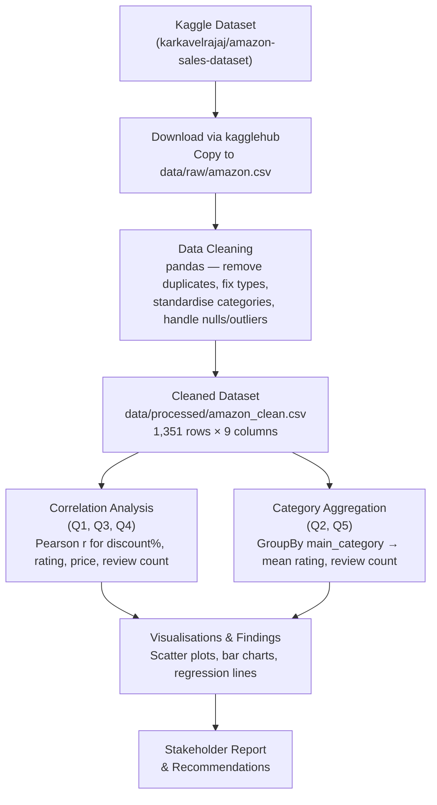

# Amazon Sales Data Analysis

> *Analyzed Amazon product pricing, discounting, and customer ratings to determine whether discount strategies drive satisfaction and engagement — and to surface category-level performance gaps.*

---

## ⚙️ Project Type Flags

- [x] Exploratory Data Analysis (EDA)
- [ ] SQL Analysis / Querying
- [ ] Dashboard / Data Visualization
- [ ] Data Pipeline / ETL
- [ ] Predictive Modelling / Machine Learning
- [x] Data Cleaning / Wrangling
- [ ] End-to-End (multiple of the above)
- [ ] Other: ___________

---

## Table of Contents
- [Amazon Sales Data Analysis](#amazon-sales-data-analysis)
  - [⚙️ Project Type Flags](#️-project-type-flags)
  - [Table of Contents](#table-of-contents)
  - [1. Project Overview](#1-project-overview)
  - [2. Objectives](#2-objectives)
  - [3. Project Scope & Tools](#3-project-scope--tools)
    - [Scope](#scope)
    - [Tools & Technologies](#tools--technologies)
  - [4. Repository Structure](#4-repository-structure)
  - [5. Data Workflow](#5-data-workflow)
  - [6. Data Model & Schema](#6-data-model--schema)
  - [8. Analysis & Metrics](#8-analysis--metrics)
    - [Analytical Approach](#analytical-approach)
    - [Key Metrics Defined](#key-metrics-defined)
    - [Methods Used](#methods-used)
  - [9. Key Insights](#9-key-insights)
  - [10. Recommendations](#10-recommendations)
  - [11. Assumptions & Limitations](#11-assumptions--limitations)
    - [Assumptions](#assumptions)
    - [Limitations](#limitations)
  - [12. Future Enhancements](#12-future-enhancements)
  - [13. Deliverables](#13-deliverables)
  - [14. Author](#14-author)

---

## 1. Project Overview

**Context:** Amazon's marketplace spans hundreds of product categories, each with its own pricing dynamics, discount strategies, and customer satisfaction profiles. The platform relies heavily on discounting as a lever to drive sales, but the relationship between discounts and customer satisfaction has not been systematically examined.

**Problem Statement:** Does offering higher discounts actually improve product ratings or increase the number of customer reviews? And which product categories are genuinely over- or under-performing on customer satisfaction?

**Approach:** The Amazon Sales Dataset (sourced from Kaggle) was cleaned and analyzed using Python. Five targeted business questions were answered using Pearson correlation analysis and category-level aggregations, supported by visualizations built with matplotlib and seaborn.

**Outcome:** Discounts showed little to no correlation with both product ratings (r = -0.162) and review volume (r = 0.003). Category-level analysis revealed that Office Products is a high-performing but undermarketed segment, while Car & Motorbike and Musical Instruments are underperforming and warrant intervention.

---

## 2. Objectives

- **Primary Objective:** Determine whether discount percentage has a meaningful correlation with product rating and review volume on Amazon.
- **Secondary Objective 1:** Identify which product categories have the highest and lowest average ratings to surface performance gaps.
- **Secondary Objective 2:** Assess whether actual product price is a signal of customer-perceived quality (rating).
- **Secondary Objective 3:** Identify high-rating, low-review categories that may be undermarketed, and develop actionable recommendations for each finding.

> 💡 *Every analysis decision in this project traces back to one of these objectives.*

---

## 3. Project Scope & Tools

### Scope

| Dimension | Details |
|-----------|---------|
| **In Scope** | Amazon product-level data: pricing, discount percentage, product ratings, review counts, and top-level product categories. Analysis covers correlations and category comparisons. |
| **Out of Scope** | Time-series analysis (no date dimension in the dataset), individual seller or brand-level analysis, customer demographic data, and A/B testing. |
| **Time Period** | Single snapshot (no temporal dimension); dataset accessed May 2026 via Kaggle. |
| **Granularity** | One row per unique `product_id` (1,351 products after cleaning). |

### Tools & Technologies

| Category | Tool(s) Used |
|----------|-------------|
| Data Storage | CSV files (`data/raw/`, `data/processed/`) |
| Data Processing | Python 3, pandas, numpy |
| Analysis | pandas (correlation, groupby), scipy |
| Visualization | matplotlib, seaborn |
| Version Control | Git / GitHub |
| Documentation | Markdown |
| Other | `kagglehub` (dataset download), `pathlib` (path management), `uv` (dependency management) |

---

## 4. Repository Structure

```
amazon-data-analysis/
│
├── data/
│   ├── raw/                  # Original, unmodified source data — never edited
│   │   └── amazon.csv
│   └── processed/            # Cleaned and transformed data
│       └── amazon_clean.csv
│
├── docs/                     # Stakeholder-facing documents
│   └── presentation.md       # 15-minute talk track for stakeholders
│
├── reports/                  # Full technical report
│   └── REPORT_TEMPLATE.md    # You are here
│
├── main.ipynb                # Full analysis notebook (Ask → Act)
├── pyproject.toml            # Project dependencies (managed by uv)
└── README.md                 # Project summary
```

---

## 5. Data Workflow



1. **Source:** Amazon Sales Dataset from Kaggle (`karkavelrajaj/amazon-sales-dataset`). Single CSV file with 1,465 rows and 16 columns covering Amazon product listings with pricing, discount, rating, and review data.
2. **Ingestion:** Downloaded programmatically using `kagglehub.dataset_download()` and copied to `data/raw/amazon.csv` using `shutil`. Loaded into a pandas DataFrame.
3. **Cleaning:**
   - Renamed columns to lowercase with underscores.
   - Dropped irrelevant columns (`product_link`, `img_link`, `user_id`, `review_id`, `review_title`, `review_content`).
   - Removed duplicate rows based on `product_id` (1,465 → 1,465 unique product IDs retained; exact duplicates removed).
   - Stripped currency symbols (`₹`) and commas from `actual_price` and `discounted_price`; converted to `float`.
   - Stripped `%` from `discount_percentage`; converted to `float`.
   - Converted `rating` and `rating_count` to numeric; coerced invalid entries to `NaN`.
   - Extracted top-level category from hierarchical `category` field (e.g., `Electronics|Wearables` → `Electronics`).
   - Dropped rows with missing values in key analytical columns.
   - Removed outliers: ratings outside [1, 5] and discount percentages outside [0, 100].
   - Final shape: **1,351 rows × 9 columns**.
4. **Transformation:** No new derived fields were required beyond the cleaning steps above. `discount_percentage` was already expressed as a percentage (0–100 scale).
5. **Analysis:** Pearson correlation between pairs of continuous variables (Q1, Q3, Q4); grouped category-level mean calculations (Q2, Q5); supported by scatter plots with regression lines and horizontal bar charts.
6. **Output:** Annotated Jupyter notebook (`main.ipynb`), cleaned CSV (`data/processed/amazon_clean.csv`), stakeholder presentation (`docs/presentation.md`), and this report.

---

## 6. Data Model & Schema

### Dataset / Table: `amazon_clean.csv`

| Field Name | Data Type | Description | Example Value |
|------------|-----------|-------------|---------------|
| `product_id` | string | Unique product identifier | `B07JW9H4J1` |
| `product_name` | string | Full product name | `Boat Bassheads 100 in Ear Wired Earphones` |
| `main_category` | string | Top-level product category (extracted from hierarchical label) | `Electronics` |
| `actual_price` | float | Original listed price in INR (₹), symbols stripped | `1799.0` |
| `discounted_price` | float | Price after discount in INR (₹) | `399.0` |
| `discount_percentage` | float | Percentage discount applied (0–100 scale) | `78.0` |
| `rating` | float | Average customer star rating (1–5 scale) | `4.1` |
| `rating_count` | float | Total number of customer ratings/reviews | `24269.0` |
| `about_product` | string | Short product description text | `10mm drivers, tangle-free cable` |

> **Row count (approx.):** 1,351 rows
> **Date range:** N/A — single snapshot dataset
> **Key join / relationship:** None (single-table analysis)

---

## 8. Analysis & Metrics

### Analytical Approach

This project is primarily exploratory — the goal was to test five specific hypotheses about Amazon's product data using descriptive statistics and correlation analysis. No predictive model was built. The analysis follows a top-down structure: each business question defines one analytical task, which is answered with a single statistical method and one visualization.

### Key Metrics Defined

| Metric | Plain-Language Definition | Why It Matters |
|--------|--------------------------|----------------|
| `discount_percentage` | The percentage reduction from the original price to the discounted price | Tests whether Amazon's discount strategy correlates with satisfaction or engagement |
| `rating` | The average star rating given by customers (1–5 scale) | Proxy for customer satisfaction and perceived product quality |
| `rating_count` | Total number of customers who left a rating or review | Proxy for customer engagement and sales volume |
| `actual_price` | The original listed price before any discount, in INR | Tests whether price is used as a quality signal by customers |
| `mean rating by category` | The average rating for all products within a top-level category | Identifies which categories are over- or under-performing on customer satisfaction |

### Methods Used

- **Pearson correlation analysis** — quantifies the linear relationship between two continuous variables (discount ↔ rating, discount ↔ review count, price ↔ rating). Interpreted using standard thresholds: near 0 = no relationship, 0.3–0.5 = moderate, 0.7–1.0 = strong.
- **GroupBy aggregation** — groups products by `main_category` and computes mean `rating` and mean `rating_count` to compare category-level performance.
- **Scatter plots with regression lines** — visualises the direction and spread of each correlation.
- **Horizontal bar charts** — ranks categories by mean rating for at-a-glance comparison.

---

## 9. Key Insights

**Insight 1: Discounts have no meaningful impact on product ratings**
The Pearson correlation between `discount_percentage` and `rating` is r = -0.162 — weak and slightly negative. Products with higher discounts do not receive better ratings; if anything, there is a marginal negative trend. This suggests that customers evaluate product quality independently of how much they saved. Discounting is not a path to better customer satisfaction scores.

**Insight 2: Category-level quality gaps are significant and actionable**
Office Products achieves the highest average rating across all categories, while Car & Motorbike and Musical Instruments both fall below 4.0 stars. This is not noise — it reflects systematic differences in product quality, delivery experience, or post-purchase support within those categories. The gap between best and worst performing categories is large enough to warrant category-specific intervention.

**Insight 3: Discounts do not drive review volume**
The correlation between `discount_percentage` and `rating_count` is r = 0.003 — effectively zero. Running deeper discounts does not generate more customer reviews or ratings. Teams relying on discount campaigns to drive review volume should reconsider this assumption.

**Insight 4: Price is not a reliable quality signal**
The correlation between `actual_price` and `rating` is r = 0.128 — weak positive. Customers do not systematically rate expensive products higher than budget ones. This supports a market segmentation strategy: budget product lines can be positioned on quality without being undermined by their lower price point.

**Insight 5: Office Products is a hidden growth opportunity**
Office Products has the highest average rating but relatively low review volume compared to categories like Electronics. This combination — high satisfaction, low visibility — signals an undermarketed segment. Increased investment in search placement, targeted campaigns, or review solicitation in this category could yield disproportionate returns.

---

## 10. Recommendations

| Priority | Recommendation | Based On | Suggested Owner |
|----------|---------------|----------|-----------------|
| High | Audit the customer experience for Car & Motorbike and Musical Instruments — investigate return rates, delivery issues, and support ticket patterns to identify root causes of below-4.0 ratings. | Insight 2 (category quality gaps) | Category Management / Customer Experience |
| High | Stop using blanket discounting as a strategy to improve ratings or generate reviews. Redirect that budget toward post-purchase follow-ups, product quality improvements, or review solicitation programs. | Insights 1 & 3 (discounts ≠ ratings, discounts ≠ reviews) | Marketing / Growth |
| Medium | Launch a targeted marketing campaign for Office Products — highlight the category's high average rating in ad copy to attract new buyers and drive review volume. | Insight 5 (Office Products undermarketed) | Marketing |
| Medium | Develop budget-tier product lines with explicit quality positioning. Since price and rating are weakly correlated, affordable products can be credibly marketed on satisfaction data. | Insight 4 (price ≠ quality signal) | Product / Merchandising |
| Low | Pilot an A/B test comparing review-solicitation email campaigns (sent post-purchase) against discount coupon campaigns to directly measure which drives more review volume per unit cost. | Insight 3 (discounts don't generate reviews) | Growth / Analytics |

---

## 11. Assumptions & Limitations

### Assumptions

- Each row in the cleaned dataset represents a unique product (`product_id` used as the deduplication key). Products sold under multiple listings were treated as one.
- The `rating` field reflects genuine customer sentiment and is not systematically manipulated.
- The top-level category extracted from the hierarchical label is a sufficient grain for category-level analysis.
- `discount_percentage` as listed reflects the actual discount received by buyers (i.e., no hidden coupons or Prime-exclusive pricing adjustments).

### Limitations

- **No time dimension:** The dataset is a single snapshot. It is impossible to analyze how ratings or discounts have changed over time, or whether seasonality affects the results.
- **Response bias in ratings:** Only customers who chose to leave a rating are included. Silent customers — who may have had negative experiences — are not represented.
- **Correlation, not causation:** All findings are correlational. No controlled experiment was run, so the direction of any causal relationship cannot be confirmed.
- **INR-only pricing:** The dataset is India-specific. Findings may not generalize to Amazon marketplaces in other countries with different pricing structures or consumer behaviors.
- **Category label granularity:** Using only the top-level category (e.g., `Electronics`) may mask important differences between sub-categories (e.g., smartphones vs. cables).

> *The goal here is pre-emptive Q&A. What would a thoughtful skeptic push back on? Document the answer here, before they ask.*

---

## 12. Future Enhancements

- [ ] Incorporate a time dimension by collecting multiple dataset snapshots across months to enable trend analysis.
- [ ] Add sub-category analysis (second-level label from the `category` field) to surface more granular performance patterns within large categories.
- [ ] Build an interactive dashboard (e.g., with Plotly or Streamlit) to allow category managers to filter and explore the data themselves.
- [ ] Extend the analysis to include seller-level data to test whether rating differences are category-driven or seller-driven.
- [ ] Run sentiment analysis on `review_content` to augment the numeric rating with qualitative signals from customer text.

---

## 13. Deliverables

| Deliverable | Description | Location |
|-------------|-------------|----------|
| Analysis Notebook | Full 6-phase analysis notebook with code, outputs, and commentary | [`main.ipynb`](../main.ipynb) |
| Cleaned Dataset | Processed CSV ready for analysis | [`data/processed/amazon_clean.csv`](../data/processed/amazon_clean.csv) |
| Raw Dataset | Original unmodified source file | [`data/raw/amazon.csv`](../data/raw/amazon.csv) |
| Stakeholder Presentation | 15-minute talk track with speaker notes | [`docs/presentation.md`](../docs/presentation.md) |
| Technical Report | This document | [`reports/REPORT_TEMPLATE.md`](REPORT_TEMPLATE.md) |

---

## 14. Author

**jack2000-dev**

---

*Last updated: May 2026*
